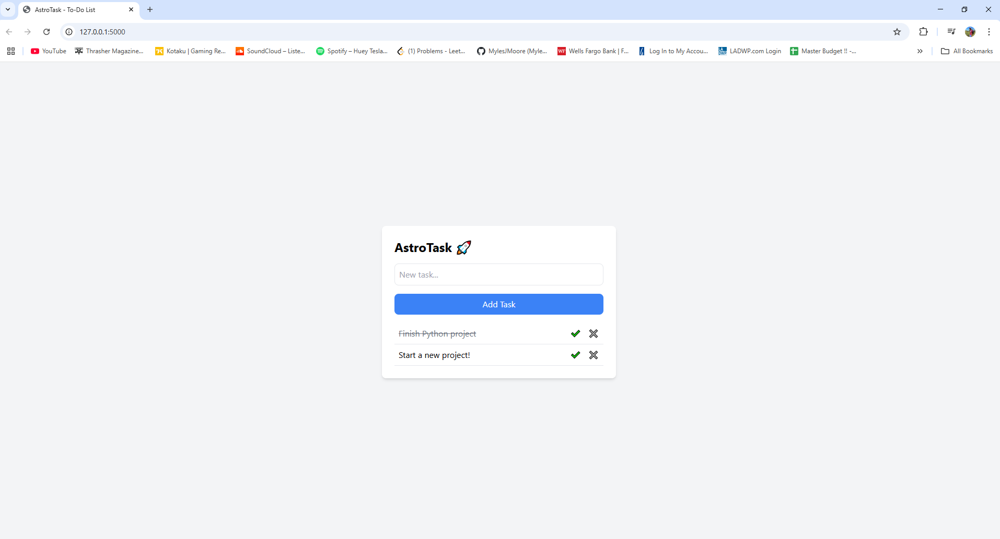

# Astro Task

AstroTask is a simple web-based to-do list application built with Flask and Tailwind CSS. It allows users to add, complete, view, and delete tasks.

## Screenshots

### Task List Interface



## Features

- **Add tasks**
- **Mark tasks as completed**
- **View all tasks**
- **Delete tasks**

## Prerequisites

Ensure you have Python installed on your system. If not, download and install it from python.org.

## Installation

1. Clone the repository:
   ```bash
   git clone https://github.com/MylesJMoore/AstroTask.git
   cd astrotask
   ```
2. Create and activate a virtual environment:
   python -m venv venv
   source venv/bin/activate # On Windows use `venv\Scripts\activate`
3. Install the required packages:
   pip install -r requirements.txt
4. Run the application:
   python app.py
5. Visit http://127.0.0.1:5000/ in your browser.

## Usage

- Add a Task: Enter a task in the input box and submit.
- Mark as Completed: Click the "Complete" button.
- Delete a Task: Click "Delete" to remove it.

## Contributing

1. Fork the repository.
2. Create a new branch (git checkout -b feature-name).
3. Commit your changes (git commit -am 'Add new feature').
4. Push to the branch (git push origin feature-name).
5. Open a Pull Request.

## License

Made by Myles Moore
This project is licensed under the MIT License - see the LICENSE file for details.
